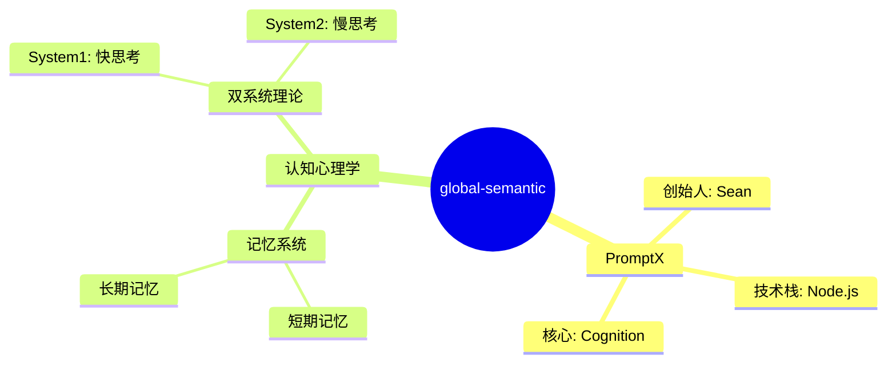

# Cognition系统PPT脚本

## 第1页 - 标题页
**标题：** 基于认知心理学的Agent记忆系统
**副标题：** PromptX Cognition - 让AI拥有真正的记忆与思考能力
**演讲者：** Sean (姜山)
**日期：** 2025年1月
**Logo：** deepractice.ai

### 演讲词：
大家好，我是Sean。今天要跟大家分享的是我们在PromptX中实现的Cognition系统——一个基于认知心理学的Agent记忆系统。

这个系统的核心理念是：让AI不再是无状态的对话机器，而是拥有真正的记忆和思考能力的认知主体。

---

## 第2页 - 为什么需要记忆系统？
**标题：** AI的认知鸿沟

### 内容要点：
- **现状问题**
  - AI每次对话都是"失忆症患者"
  - 无法积累经验和知识
  - 无法形成连贯的思维链
  
- **认知心理学启发**
  - 人类记忆的双系统理论（System 1 & System 2）
  - 记忆巩固与提取机制
  - 语义网络与激活扩散

- **我们的解决方案**
  - Cognition = Mind（心智） + Memory（记忆）
  - 模拟人类认知过程
  - 实现跨对话的记忆持久化

### 演讲词：
为什么我们需要给AI加上记忆系统？想象一下，如果你每次醒来都忘记了昨天发生的一切，你还能有效学习和工作吗？这就是当前AI面临的问题。

我们从认知心理学中获得灵感，人类的记忆系统是如此精妙——有快速的直觉反应，也有深度的逻辑思考。我们的Cognition系统就是要模拟这个过程。

---

## 第3页 - 系统架构总览
**标题：** Cognition系统架构

### 架构图：
```
┌─────────────────────────────────────────┐
│           Cognition API                 │
│  remember() | recall() | think() | prime()│
└─────────────┬───────────────────────────┘
              │
    ┌─────────┴─────────┐
    │                   │
┌───▼────┐      ┌───────▼──────┐
│  Mind  │◄────►│    Memory    │
│ 心智系统│      │   记忆系统    │
└───┬────┘      └───────┬──────┘
    │                   │
    │                   ├── ShortTerm (短期记忆)
    │                   ├── LongTerm (长期记忆)
    │                   ├── Semantic (语义记忆)
    │                   └── Procedural (程序性记忆)
    │
    ├── NetworkSemantic (语义网络)
    ├── GraphSchema (知识图式)
    └── WordCue (概念节点)
```

### 演讲词：
Cognition系统的架构非常简洁，但功能强大。顶层只暴露4个核心API：记住、回忆、思考和启动。

底层分为两大系统：Mind负责知识的组织和激活，Memory负责记忆的存储和提取。这种设计完全模拟了人类的认知架构。

---

## 第4页 - 核心概念：Engram（记忆痕迹）
**标题：** Engram - 记忆的基本单位

### 代码示例：
```javascript
// 一个Engram包含什么？
const engram = {
  id: "timestamp-001",
  content: "Sean是PromptX的创始人",  // 自然语言内容
  schema: `mindmap
    人物关系
      Sean
        角色: 创始人
        项目: PromptX`,          // 结构化认知
  type: "ATOMIC",                // 记忆类型
  strength: 0.9,                 // 记忆强度
  timestamp: new Date()
}
```

### 三种记忆类型：
- **ATOMIC（原子记忆）**：单一概念或事实
- **LINK（关联记忆）**：概念间的关系
- **PATTERN（模式记忆）**：复杂的认知模式

### 演讲词：
Engram是我们系统中记忆的基本单位。每个Engram不仅包含自然语言的内容，更重要的是包含了结构化的认知图式。

这个设计的巧妙之处在于：它既保留了人类可读的形式，又构建了机器可处理的知识结构。

---

## 第5页 - 记忆系统：四种记忆类型
**标题：** 仿生记忆架构

### 记忆类型对比：
| 记忆类型 | 认知心理学对应 | 功能 | 实现 |
|---------|--------------|------|------|
| **短期记忆** | Working Memory | 临时存储，容量有限 | 内存队列，自动溢出 |
| **长期记忆** | Long-term Memory | 永久存储，容量无限 | NeDB持久化 |
| **语义记忆** | Semantic Memory | 概念网络，知识图谱 | Graph + Mindmap |
| **程序性记忆** | Procedural Memory | 行为模式，技能 | Pattern存储 |

### 代码示例：
```javascript
// 记忆的完整流程
await cognition.remember(content, schema, strength);
// 1. 短期记忆接收
// 2. 评估重要性
// 3. 巩固到长期记忆
// 4. 更新语义网络
// 5. 提取行为模式
```

### 演讲词：
我们实现了四种记忆类型，完全对应认知心理学的记忆分类。短期记忆负责临时存储，长期记忆负责持久化，语义记忆构建知识网络，程序性记忆保存行为模式。

这种设计让AI能像人一样，既能记住事实，又能形成概念网络，还能学会"技能"。

---

## 第6页 - Mind系统：三层认知架构
**标题：** 层次化的认知组织

### 三层架构：
```
Layer 3: NetworkSemantic（全局语义网络）
         ├── 完整的认知地图
         └── 跨领域知识整合
                    ▲
                    │
Layer 2: GraphSchema（知识图式）
         ├── 事件框架
         └── 概念群组
                    ▲
                    │
Layer 1: WordCue（概念节点）
         ├── 基本概念
         └── 原子知识
```

### 层次主导原则：
- 高层可以包含低层
- 同层可以相互连接
- 低层不能包含高层

### 演讲词：
Mind系统采用三层架构，从最基础的概念节点，到中间的知识图式，再到顶层的全局语义网络。

这种层次化设计的好处是：既保证了知识的原子性，又实现了知识的系统性组织。就像我们的大脑，既能处理单个概念，又能形成复杂的认知结构。

---

## 第7页 - 语义网络：知识的动态组织
**标题：** 动态语义网络

### Mindmap可视化：


### 关键特性：
- **动态增长**：新知识自动整合
- **权重更新**：基于访问频率调整
- **激活扩散**：相关概念自动激活
- **持久化存储**：跨会话保持

### 演讲词：
语义网络是整个系统的核心。它不是静态的知识库，而是动态增长的认知网络。

每次recall都会更新节点权重，每次remember都会扩展网络结构。这就像人脑一样，越常用的知识越容易被想起，新知识会自动与已有知识建立联系。

---

## 第8页 - Think：思维链的实现
**标题：** 模拟人类思考过程

### Thought对象结构：
```javascript
const thought = {
  // 1. 思考目标
  goalEngram: "如何优化记忆检索？",
  
  // 2. 思维模式
  thinkingPattern: "reasoning",  // 推理模式
  
  // 3. 激活线索
  spreadActivationCues: ["记忆", "检索", "优化"],
  
  // 4. 回忆的相关记忆
  recalledEngrams: [...],
  
  // 5. 产生的洞察
  insightEngrams: ["建立索引可以加速检索"],
  
  // 6. 最终结论
  conclusionEngram: "使用倒排索引优化",
  
  // 7. 置信度
  confidence: 0.85
}
```

### 思维模式：
- **Reasoning（推理）**：逻辑推导
- **Creative（创造）**：发散思维
- **Critical（批判）**：评估分析

### 演讲词：
Think功能是Cognition的高级特性。它不是简单的模板填充，而是真正模拟了人类的思考过程。

从设定目标，选择思维模式，激活相关记忆，到产生洞察，形成结论，评估置信度——这是一个完整的认知链条。

---

## 第9页 - 实际应用案例
**标题：** 真实场景演示

### 场景1：知识积累
```javascript
// 第一次对话
await cognition.remember(
  "用户喜欢使用TypeScript", 
  "mindmap\n  用户偏好\n    编程语言\n      TypeScript",
  0.9
);

// 第二次对话（一周后）
const memories = await cognition.recall("TypeScript");
// 系统记得用户的偏好！
```

### 场景2：经验学习
```javascript
// 记住错误经验
await cognition.remember(
  "不要在生产环境直接修改数据库",
  "mindmap\n  最佳实践\n    数据库操作\n      禁止事项\n        直接修改生产数据",
  1.0  // 最高强度，永远记住！
);
```

### 场景3：智能推理
```javascript
// 基于记忆进行推理
const thought = await cognition.think({
  goalEngram: "如何提升系统性能？",
  thinkingPattern: "reasoning",
  spreadActivationCues: ["性能", "优化", "系统"]
});
// 系统会调用相关记忆，推理出优化方案
```

### 演讲词：
让我展示三个实际应用场景。第一个是知识积累，系统能记住用户偏好。第二个是经验学习，记住重要的教训。第三个是智能推理，基于积累的记忆进行思考。

这些不是demo，而是真实运行的代码。

---

## 第10页 - 技术创新点
**标题：** 核心技术突破

### 创新点：
1. **Mindmap as Schema**
   - 使用Mermaid mindmap作为认知结构
   - 人机共读的知识表示

2. **层次化Mind架构**
   - 三层认知组织
   - 层次主导原则

3. **双系统记忆实现**
   - System 1：快速内隐记忆
   - System 2：深度显式记忆

4. **动态权重机制**
   - 基于访问频率的权重更新
   - 遗忘曲线模拟

5. **思维链引导**
   - 结构化的思考过程
   - 可控的认知加工

### 演讲词：
我们的技术创新不是为了创新而创新，每一个设计都有认知科学的理论支撑。

比如用Mindmap作为Schema，既保证了人类可读性，又实现了机器可处理性。这种双重可读性是AI系统人机协作的关键。

---

## 第11页 - 性能与优化
**标题：** 工程实现优化

### 性能指标：
- **记忆写入**：< 10ms
- **记忆检索**：< 50ms（千条记忆）
- **语义网络构建**：< 100ms
- **持久化存储**：异步非阻塞

### 优化策略：
```javascript
// 1. 立即巩固（0容量短期记忆）
this.shortTerm = new ShortTerm(evaluator, consolidator, 0);

// 2. 异步持久化
setImmediate(() => this.persist().catch(console.error));

// 3. 索引优化
this.db.ensureIndex({ fieldName: 'cues' });

// 4. 缓存机制
if (!this.currentSemantic || this.currentSemantic.name !== semanticName) {
  this.currentSemantic = await NetworkSemantic.load(storagePath, semanticName);
}
```

### 演讲词：
性能是我们非常关注的点。通过立即巩固、异步持久化、索引优化等策略，我们实现了毫秒级的响应。

即使在大规模记忆库的情况下，系统依然能保持高效运行。

---

## 第12页 - 与现有方案对比
**标题：** 竞争优势分析

### 对比表：
| 特性 | Cognition | LangChain Memory | MemGPT | RAG |
|-----|-----------|-----------------|---------|-----|
| 认知心理学基础 | ✅ 完整实现 | ❌ | ⚠️ 部分 | ❌ |
| 结构化认知 | ✅ Mindmap | ❌ | ❌ | ❌ |
| 多层记忆系统 | ✅ 四种类型 | ⚠️ 简单 | ⚠️ 两种 | ❌ |
| 思维链支持 | ✅ 原生支持 | ❌ | ❌ | ❌ |
| 语义网络 | ✅ 动态图 | ❌ | ❌ | ⚠️ 向量 |
| 持久化 | ✅ 高效 | ✅ | ✅ | ✅ |

### 独特优势：
- 真正的认知架构，不是简单的存储
- 可解释的记忆组织
- 人机共读的知识表示

### 演讲词：
与现有方案相比，Cognition不是简单的"记忆存储"，而是完整的认知系统。

我们不只是存储信息，而是构建知识；不只是检索数据，而是激活认知；不只是返回结果，而是进行思考。

---

## 第13页 - 未来规划
**标题：** Roadmap

### 短期目标（Q1 2025）：
- [ ] 多模态记忆支持（图像、音频）
- [ ] 分布式记忆网络
- [ ] 更多思维模式（类比、归纳、批判）
- [ ] 记忆压缩与遗忘机制

### 中期目标（Q2-Q3 2025）：
- [ ] 记忆迁移学习
- [ ] 群体认知（多Agent共享记忆）
- [ ] 情景记忆与时序推理
- [ ] 认知负荷自适应

### 长期愿景：
- 构建真正的AGI认知基础设施
- 开源认知计算标准
- 推动AI认知革命

### 演讲词：
我们的愿景是让每个AI Agent都拥有自己的认知系统。短期内我们会支持多模态记忆，中期实现群体认知，长期目标是成为AGI的认知基础设施。

这不仅是技术进步，更是AI认知革命的开始。

---

## 第14页 - 代码示例：完整使用流程
**标题：** Quick Start

```javascript
// 1. 初始化Cognition系统
const { Cognition } = require('@promptx/cognition');
const cognition = new Cognition({
  longTermPath: './memory/longterm',
  semanticPath: './memory/semantic'
});

// 2. 记住重要信息
await cognition.remember(
  "PromptX是基于认知心理学的AI系统",
  `mindmap
    PromptX
      特点: 认知心理学
      功能: AI记忆系统`,
  0.9  // 高强度记忆
);

// 3. 回忆相关信息
const memories = await cognition.recall("PromptX");
console.log(`找到 ${memories.length} 条相关记忆`);

// 4. 激活语义网络
const mindmap = await cognition.prime();
console.log('当前认知网络：', mindmap);

// 5. 进行思考
const thought = await cognition.think({
  goalEngram: "如何改进PromptX？",
  thinkingPattern: "reasoning",
  spreadActivationCues: ["改进", "优化", "PromptX"]
});
```

### 演讲词：
使用Cognition系统非常简单。五行代码就能让你的AI拥有记忆能力。这个例子展示了完整的使用流程。

---

## 第15页 - 总结
**标题：** 让AI真正"认知"

### 核心价值：
- 🧠 **真正的认知架构**：不是存储，是思考
- 🔄 **持续学习能力**：每次对话都在成长
- 🌐 **知识网络构建**：从信息到智慧
- 🎯 **可解释的推理**：知其然知其所以然

### 应用场景：
- 个人AI助手（真正了解你）
- 企业知识管理（组织记忆）
- 教育AI（因材施教）
- 研究助手（知识发现）

### Call to Action：
- GitHub: github.com/Deepractice/PromptX
- 文档: promptx.deepractice.ai
- 联系: sean@deepractice.ai

### 演讲词：
Cognition系统的目标很简单：让AI真正具备认知能力。不再是无状态的对话机器，而是能学习、能思考、能成长的认知主体。

这是我们向AGI迈出的重要一步。欢迎大家一起参与这场认知革命！

---

## 第16页 - Q&A
**标题：** Questions & Discussion

### 预期问题准备：

**Q1: 与向量数据库的区别？**
A: 向量数据库是基于相似度的检索，我们是基于认知结构的激活。不仅找到相似的，还能推理出相关的。

**Q2: 性能瓶颈在哪里？**
A: 目前主要在语义网络的构建。我们通过缓存和增量更新来优化。

**Q3: 如何处理记忆冲突？**
A: 通过记忆强度和时间戳来判断。新的高强度记忆会覆盖旧的低强度记忆。

**Q4: 支持分布式部署吗？**
A: 目前是单机版本，分布式版本在规划中。核心挑战是语义网络的分片。

**Q5: 如何防止记忆污染？**
A: 通过记忆评估器（Evaluator）过滤，只有重要的信息才会进入长期记忆。

### 演讲词：
谢谢大家的聆听！现在是Q&A时间，欢迎提出任何问题。

---

## 演讲备注

### 时间分配（假设30分钟）：
- 开场介绍：2分钟
- 问题与动机：3分钟
- 架构介绍：5分钟
- 核心概念：8分钟
- 技术细节：5分钟
- 案例演示：3分钟
- 未来规划：2分钟
- Q&A：2分钟

### 重点强调：
1. 认知心理学的理论支撑
2. 与传统方案的本质区别
3. 实际运行的代码，不是概念
4. 简洁但强大的API设计

### 演示准备：
- [ ] 准备实际运行的Demo
- [ ] 准备性能测试数据
- [ ] 准备可视化的语义网络图
- [ ] 准备常见问题的标准答案

### 注意事项：
- 避免过多技术细节，focus在理念和价值
- 用类比帮助理解（如"AI的海马体"）
- 强调实用性，不要太学术
- 准备几个"wow moment"

---

## 补充材料

### 相关论文引用：
1. Collins, A. M., & Loftus, E. F. (1975). A spreading-activation theory of semantic processing.
2. Tulving, E., & Thomson, D. M. (1973). Encoding specificity and retrieval processes in episodic memory.
3. Squire, L. R. (1987). Memory and brain.
4. Kahneman, D. (2011). Thinking, fast and slow.

### 代码仓库结构：
```
cognition/
├── memory/          # 记忆系统
├── mind/           # 心智系统  
├── thinking/       # 思维系统
├── engram/         # 记忆痕迹
└── Cognition.js    # 主入口
```

### 致谢：
- 认知心理学研究者们的理论贡献
- PromptX团队的共同努力
- 开源社区的支持与反馈